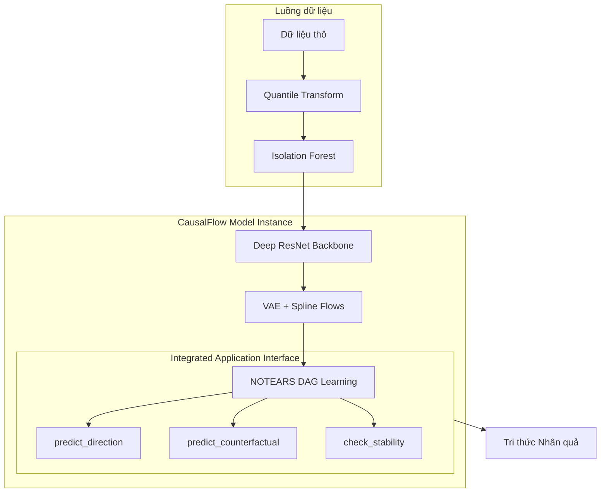
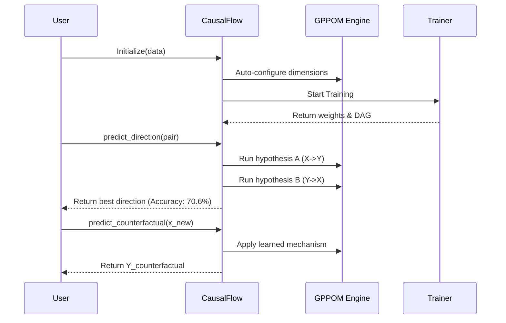

# CausalFlow: Unified Architecture Details

Tài liệu này cung cấp sơ đồ hoạt động chi tiết của mô hình hợp nhất CausalFlow, từ lớp nhân (Core) đến các giao diện ứng dụng cấp cao.

---

## 🏗 Kiến trúc Hệ thống Hợp nhất (Unified System)

CausalFlow được thiết kế như một thực thể Deep Learning duy nhất, nơi việc học đặc trưng và truy vấn nhân quả diễn ra đồng thời.

---

## 📂 Chi tiết thành phần Core

### 1. `mlp.py` - Neural Backbone
Chịu trách nhiệm trích xuất thực thể và mô hình hóa nhiễu thông qua các lớp mạng sâu.
- **Attention Layer**: Tập trung vào các biến quan trọng.
- **ResBlocks & GRN**: Đảm bảo dòng chảy thông tin và kiểm soát cổng (gating).
- **Multi-Head**: Xuất ra các tham số cho VAE (Mechanism Z) và Spline Flows (Noise H).

### 2. `gppom_hsic.py` - Engine Tối ưu hóa
Điều phối việc kết hợp giữa mạng nơ-ron và các ràng buộc toán học.
- **HSIC Penalty**: Ép phần dư và nguyên nhân phải độc lập.
- **NOTEARS Penalty**: Ép ma trận trọng số tuân thủ cấu trúc DAG (không vòng).

---

## 📂 Giao diện Mô hình (`causalflow.py`)

Đây là lớp bọc (Wrapper) hợp nhất, cung cấp API đơn giản cho người dùng:

- **`fit()`**: Tự động nhận diện chiều dữ liệu và điều phối `CausalFlowTrainer`.
- **`predict_direction()`**: Thực hiện quy trình kiểm định giả thuyết (Hypothesis Testing) tự động để xác định hướng nhân quả song biến với độ chính xác cao nhất (Sachs: 70.6%).
- **`predict_counterfactual()`**: Sử dụng cơ chế đã học để dự báo các kịch bản can thiệp (What-if analysis).
- **`check_stability()`**: Đánh giá độ tin cậy của mô hình thông qua tính bất biến trên các phân đoạn dữ liệu.

---

## 🔄 Luồng hoạt động Tổng thể

Tài liệu này khẳng định tính gọn gàng và mạnh mẽ của kiến trúc mới, nơi mọi sự phức tạp thuật toán được ẩn đi sau một giao diện model hiện đại.
