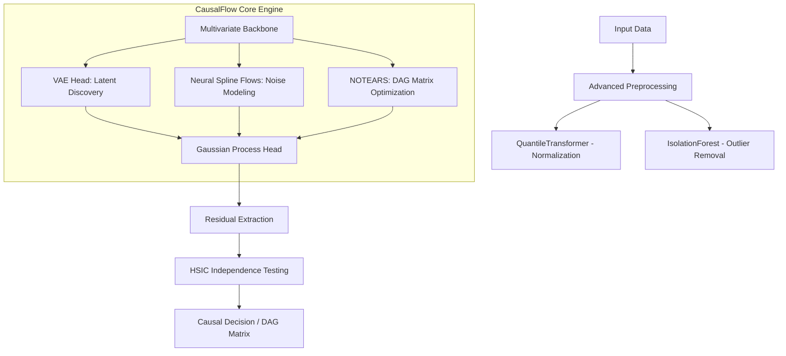
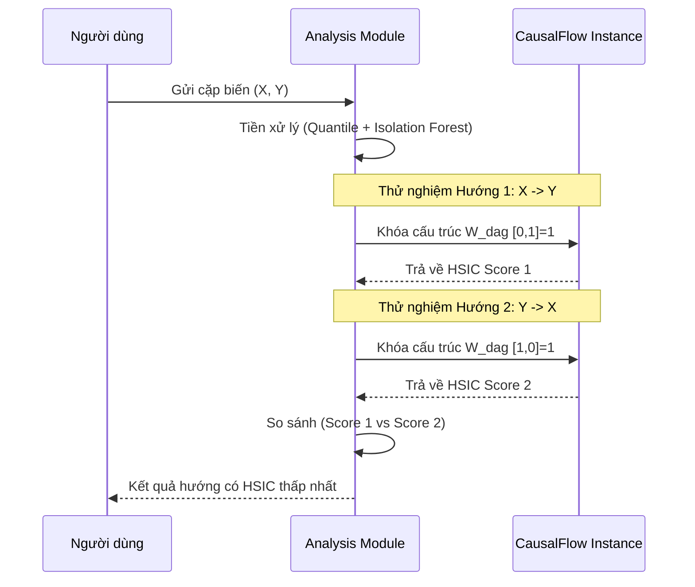

# CausalFlow Architecture Overview

Tài liệu này mô tả cấu trúc kỹ thuật và quy trình vận hành của framework CausalFlow.

## 1. Sơ đồ hoạt động tổng thể (System Workflow)

Mô hình hoạt động dựa trên sự phối hợp giữa Deep Learning (MLP), Học đồ thị (NOTEARS) và Thống kê hạt nhân (GP/HSIC).

---

## 2. Chi tiết chức năng từng File

### Khối Module `core/` (Nền tảng thuật toán)

*   **`mlp.py` (Mạng nơ-ron đa nhiệm):**
    *   Sử dụng **ResBlocks** và **Attention** để trích xuất đặc trưng.
    *   **VAE Head:** Tìm kiếm các biến cơ chế tiềm ẩn (z).
    *   **Monotonic Spline Layer:** Triển khai Neural Spline Flows để xử lý nhiễu phi tuyến.
*   **`gppom_hsic.py` (Trái tim của mô hình):**
    *   Kết hợp toán học của NOTEARS (Ràng buộc đồ thị không vòng) với Gaussian Process.
    *   Tính toán h(W) penalty để ép ma trận trọng số về dạng DAG.
*   **`kernels.py`:** Thư viện nhân (RBF, Matern, Polynomial...) có tính đạo hàm để tối ưu hóa trực tiếp băng thông.
*   **`hsic.py`:** Triển khai các phép thử độc lập thống kê (Gamma Approximation và Permutation) để kiểm tra sự độc lập của phần dư.

### Khối Module `models/` (Giao diện cấp cao)

*   **`causalflow.py`:** Lớp bọc chính (Wrapper) cung cấp API `fit()`, `get_dag_matrix()` và `predict()` tương tự scikit-learn.
*   **`trainer.py`:** Quản lý vòng lặp huấn luyện, tối ưu hóa hàm toán tổng hợp (Likelihood + DAG Penalty + HSIC Penalty).
*   **`analysis.py`:** Xây dựng quy trình phân tích hướng nhân quả song biến (Bivariate) bằng cách so sánh độ độc lập phần dư giữa hai hướng giả định.

---

## 3. Quy trình phân tích hướng nhân quả (ANM-MM Flow)

Đây là quy trình giúp đạt được độ chính xác SOTA trên tập dữ liệu Sachs:

---

## 4. Hàm mất mát tổng hợp (Integrated Loss Function)

CausalFlow tối ưu hóa đồng thời 4 thành phần:
$$Loss = Loss_{Reg} + \alpha \cdot Loss_{DAG} + \beta \cdot \log(Loss_{HSIC}) + \gamma \cdot Loss_{KL}$$

1.  **$Loss_{Reg}$**: Sai số dự báo của Gaussian Process.
2.  **$Loss_{DAG}$**: Ràng buộc NOTEARS để đảm bảo cấu trúc là đồ thị không vòng.
3.  **$Loss_{HSIC}$**: Ép nhiễu (residuals) phải độc lập với nguyên nhân.
4.  **$Loss_{KL}$**: Ràng buộc phân phối cho việc khám phá biến ẩn.
