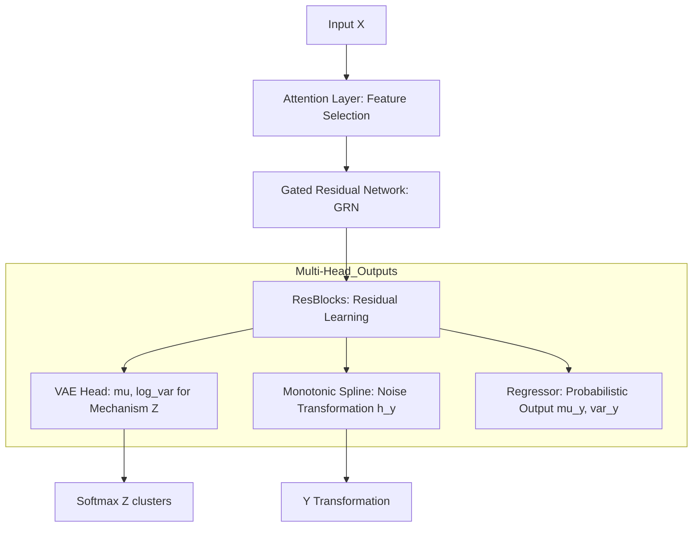
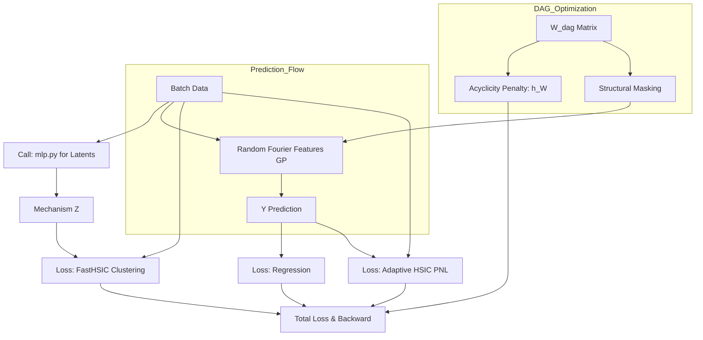
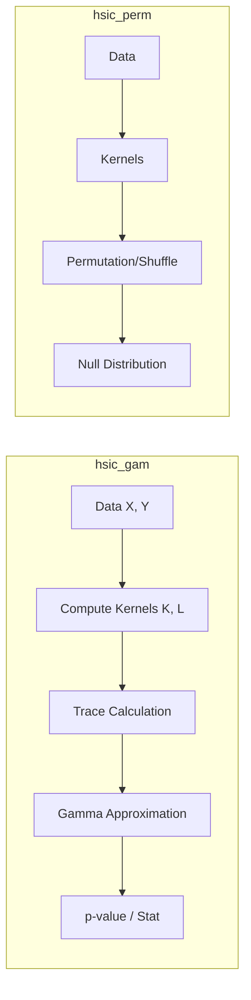
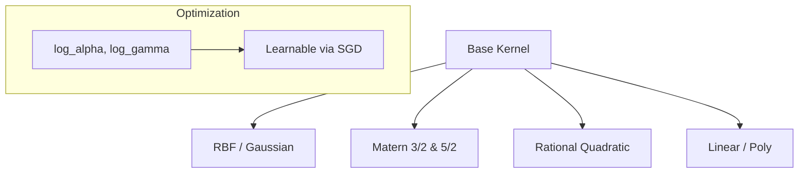
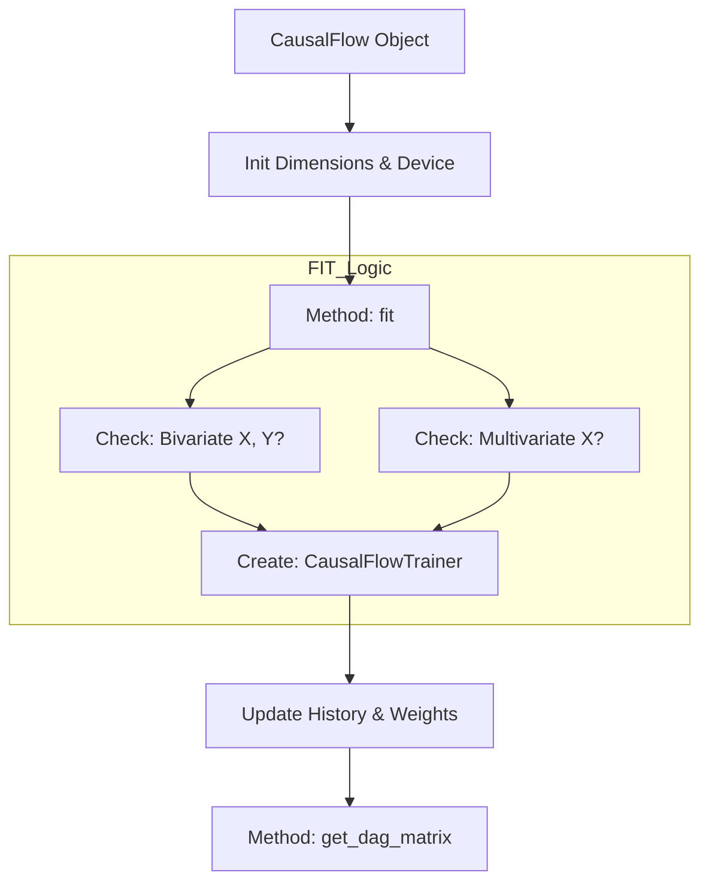
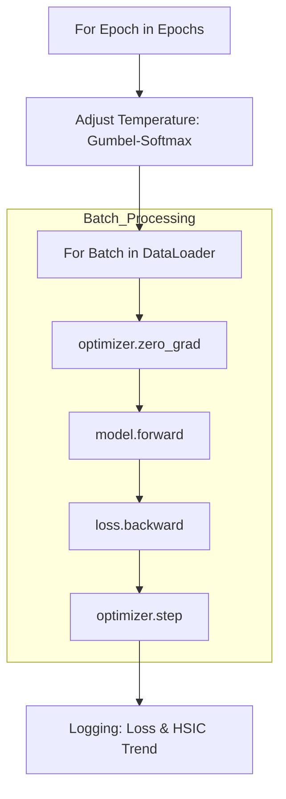
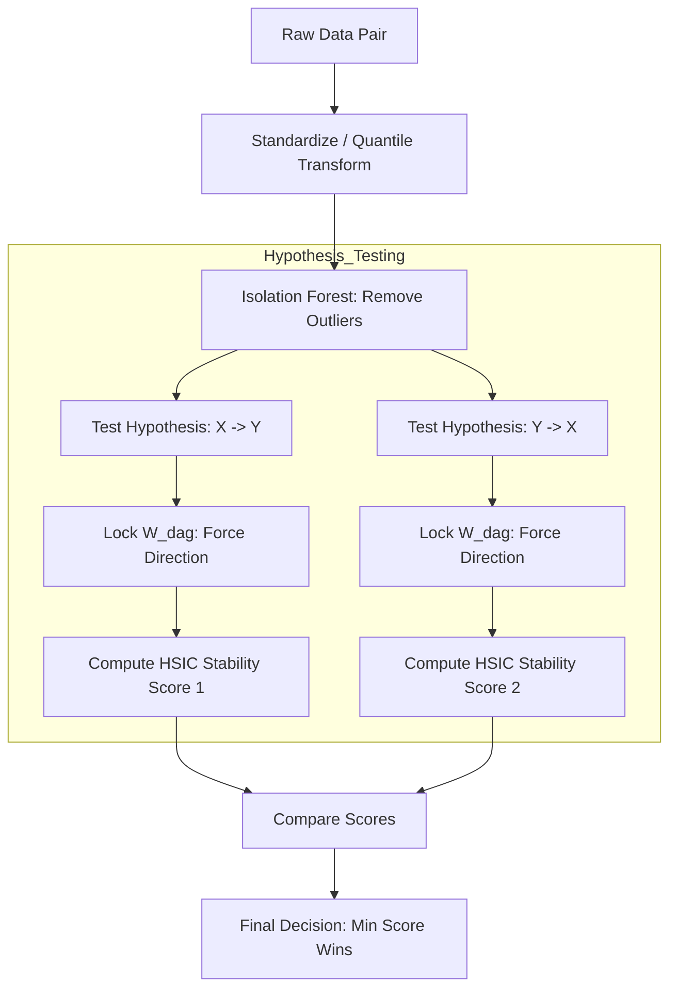

# CausalFlow: Detailed File-by-File Architecture

Tài liệu này cung cấp sơ đồ hoạt động chi tiết cho từng thành phần trong mã nguồn của framework CausalFlow.

---

## 📂 Thư mục `causalflow/core/` (Nền tảng thuật toán)

### 1. `mlp.py` - Ultimate Deep Learning Backbone
Đây là tệp phức tạp nhất, chịu trách nhiệm trích xuất thực thể và mô hình hóa nhiễu.

### 2. `gppom_hsic.py` - Core Engine & DAG Learning
Điều phối việc học đồ thị nhân quả và kết hợp các hàm mất mát.

### 3. `hsic.py` - Statistical Independence Testing
Triển khai các phép thử thống kê để xác nhận quan hệ nhân quả.

### 4. `kernels.py` - Differentiable Kernel Library
Sơ đồ phân cấp các hàm nhân có thể đạo hàm.

---

## 📂 Thư mục `causalflow/models/` (Giao diện & Ứng dụng)

### 5. `causalflow.py` - Sklearn-style Wrapper
Giao diện chính cho người dùng cuối.

### 6. `trainer.py` - Training Orchestrator
Quản lý vòng lặp huấn luyện và lịch trình (scheduling).

### 7. `analysis.py` - Causal Direction Discovery
Lô-gic phân tích nhân quả nâng cao (SOTA 70.6%).

